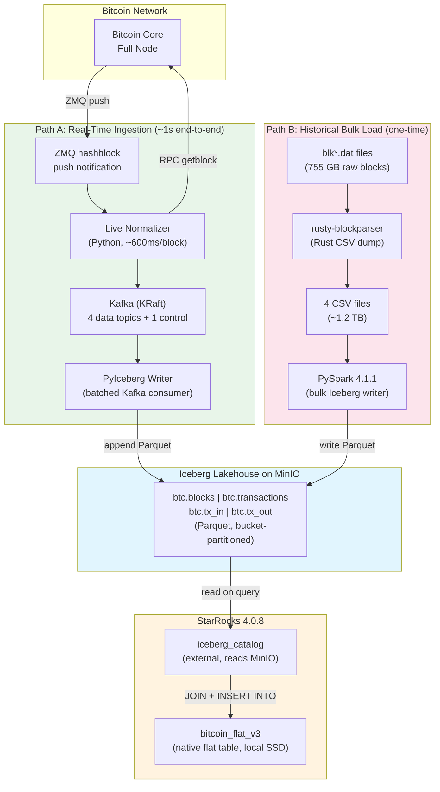
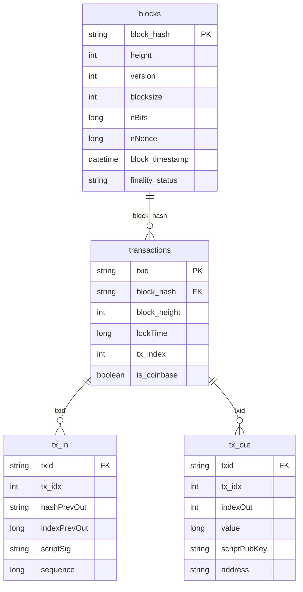
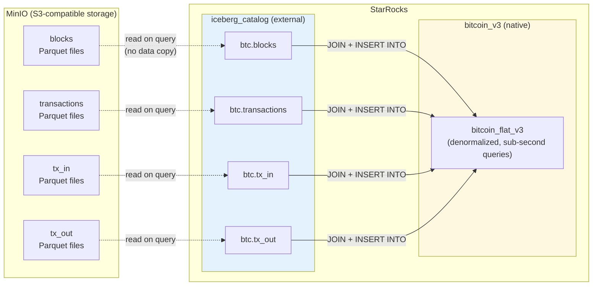
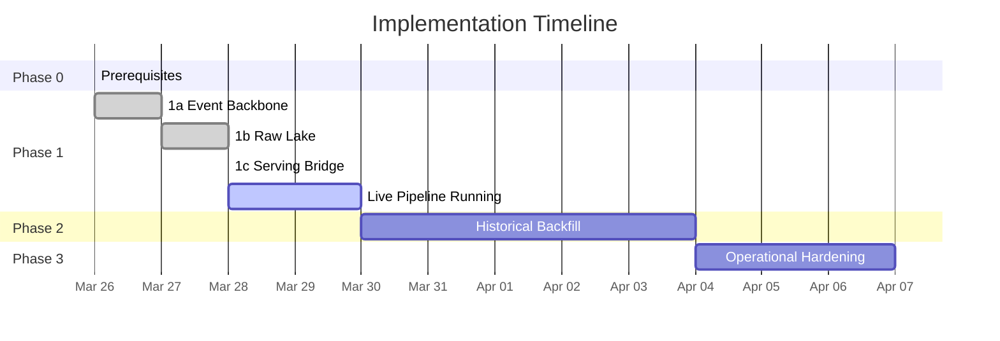

# Realtime Bitcoin Ingestion & Analytics

A real-time Bitcoin blockchain analytics platform that ingests blocks within seconds of being mined, lands them in an Iceberg lakehouse on MinIO, and serves denormalized flat tables from StarRocks.

```
 ____            _ _   _                  ____  _ _            _
|  _ \ ___  __ _| | |_(_)_ __ ___   ___ | __ )(_) |_ ___ ___ (_)_ __
| |_) / _ \/ _` | | __| | '_ ` _ \ / _ \|  _ \| | __/ __/ _ \| | '_ \
|  _ <  __/ (_| | | |_| | | | | | |  __/| |_) | | || (_| (_) | | | | |
|_| \_\___|\__,_|_|\__|_|_| |_| |_|\___||____/|_|\__\___\___/|_|_| |_|
 ___                       _   _                ___
|_ _|_ __   __ _  ___  __| |_(_) ___  _ __    ( _ )
 | || '_ \ / _` |/ _ \/ __| __| |/ _ \| '_ \  / _ \
 | || | | | (_| |  __/\__ \ |_| | (_) | | | || (_) |
|___|_| |_|\__, |\___||___/\__|_|\___/|_| |_| \___/
           |___/
    _                _       _   _
   / \   _ __   __ _| |_   _| |_(_) ___ ___
  / _ \ | '_ \ / _` | | | | | __| |/ __/ __|
 / ___ \| | | | (_| | | |_| | |_| | (__\__ \
/_/   \_\_| |_|\__,_|_|\__, |\__|_|\___|___/
                        |___/
```

**Started:** 2026-03-26
**Live since:** 2026-03-28 (Phase 1 pipeline running, ingesting blocks in real time)
**Reference repo:** `/local-scratch4/bitcoin_2025/legacy-batch-pipeline/` (batch-only predecessor)
**Architecture plan:** [nifty-sauteeing-spring-evaluation-report-v3.md](../nifty-sauteeing-spring-evaluation-report-v3.md)
**Implementation plan:** [plan.md](plan.md)

---

## Architecture

```
+==========================================================================+
|                     BITCOIN REAL-TIME PIPELINE                           |
+==========================================================================+
|                                                                          |
|  LIVE PATH (new blocks, ~250ms end-to-end):                             |
|                                                                          |
|  +-------------+  ZMQ   +----------------+  JSON  +------------------+   |
|  | Bitcoin Core |------->| Live Normalizer|------->| Kafka (KRaft)    |   |
|  | (full node)  |<-------| (Python)       |        | 4 data topics    |   |
|  +-------------+  RPC   +----------------+        | 1 control topic  |   |
|                                                    +--------+---------+   |
|                                                             |            |
|                                      +----------------------+            |
|                                      |                      |            |
|                                      v                      v            |
|                       +--------------------+  +---------------------+    |
|                       | PyIceberg Writer   |  | PyIceberg Finality  |    |
|                       | (Kafka consumer)   |  | Updater             |    |
|                       | (append: new data) |  | (upsert: status)    |    |
|                       +---------+----------+  +----------+----------+    |
|                                 |                        |               |
|                                 +------------+-----------+               |
|                                              |                           |
|                                              v                           |
|                               +----------------------------+             |
|                               |    Iceberg on MinIO        |             |
|                               |    (raw source of truth)   |             |
|                               |                            |             |
|                               |  btc.blocks      ~900K    |             |
|                               |  btc.transactions ~1B     |             |
|                               |  btc.tx_in       ~2.5B    |             |
|                               |  btc.tx_out      ~2.7B    |             |
|                               +-------------+--------------+             |
|                                             |                            |
|                                             v                            |
|                               +----------------------------+             |
|                               |    StarRocks (4.0.8)       |             |
|                               |    External Iceberg cat.   |             |
|                               |    Native flat serving tbl |             |
|                               +----------------------------+             |
|                                                                          |
|  HISTORICAL PATH (one-time backfill):                                    |
|                                                                          |
|  blk*.dat --> rusty-blockparser --> CSV --> Spark --> Iceberg on MinIO    |
|                                                                          |
|  TABLE MAINTENANCE (Spark, scheduled):                                   |
|  Compact files | Expire snapshots | Remove orphans | Rewrite manifests   |
+==========================================================================+
```

**Key change from original plan:** Kafka Connect Iceberg Sink was replaced with a
PyIceberg-based writer because the runtime ZIP is not available as a pre-built
download. PyIceberg provides native upsert with identifier fields for idempotent
writes and was the "valid fallback" path from the V3 architecture document.

### Architecture (Mermaid)



---

## Dual-Path Data Convergence

Both the real-time pipeline and the historical bulk load write to the **same Iceberg
tables** on MinIO. Iceberg merges them seamlessly — they are just additional Parquet
data files registered in the same table metadata.

```
 TIME ──────────────────────────────────────────────────────────>

 HISTORICAL (Path B)                 REAL-TIME (Path A)
 ~~~~~~~~~~~~~~~~~~~~               ~~~~~~~~~~~~~~~~~~

 Block 0 ─────────── Block 942,724  Block 942,725 ───── Block N
 |                              |   |                        |
 | rusty-blockparser            |   | Live Normalizer        |
 |   (blk*.dat -> CSV)         |   |   (ZMQ + RPC)          |
 |                              |   |                        |
 | PySpark                      |   | Kafka                  |
 |   (CSV -> Iceberg Parquet)  |   |   (4 topics)           |
 |                              |   |                        |
 +──────────────────────────────+   | PyIceberg Writer       |
                |                   |   (append Parquet)     |
                |                   |                        |
                v                   v                        |
         +============================================+      |
         |        Iceberg on MinIO                    |      |
         |        (unified Parquet files)             |<─────+
         |                                            |
         |  Both paths produce identical schemas:     |
         |  blocks, transactions, tx_in, tx_out       |
         +============================================+
                          |
                          v
                  StarRocks queries
                  all data uniformly
```

| Aspect | Path A: Real-Time | Path B: Historical Bulk |
|--------|-------------------|------------------------|
| **Source** | ZMQ + RPC (live Bitcoin Core) | blk*.dat files on disk |
| **Parser** | Python (live-normalizer) | Rust (rusty-blockparser) |
| **Transport** | Kafka -> PyIceberg | PySpark direct write |
| **Volume** | ~6,000 tx/block, every ~10 min | ~1B transactions, one-time |
| **Speed** | ~1s per block | Hours for full history |
| **When** | Continuously, from block 942,725+ | One-time backfill (Phase 2) |
| **Status** | Running since 2026-03-28 | Not started |

---

## Quick Start

```bash
# 1. Install UV and dependencies
curl -LsSf https://astral.sh/uv/install.sh | sh
uv venv .venv --python 3.10
source .venv/bin/activate
uv pip install -e ".[dev]"

# 2. Start infrastructure
sudo docker compose up -d

# 3. Create Kafka topics
bash scripts/create-kafka-topics.sh

# 4. Create Iceberg tables (requires HMS healthy)
python scripts/create_iceberg_tables.py

# 5. Create StarRocks catalog + flat table
mysql -h 127.0.0.1 -P 9030 -u root < starrocks/iceberg_catalog_v3.sql
mysql -h 127.0.0.1 -P 9030 -u root < starrocks/flat_serving_v3.sql

# 6. Test normalizer (no Kafka needed)
python live-normalizer/main.py --test-block 0

# 7. Run unit tests (133 tests, no external deps)
pytest tests/unit/

# 8. Run integration tests (requires Docker services)
pytest tests/integration/ -m integration
```

### Running the Live Pipeline

```bash
# Start the live normalizer (Bitcoin Core -> Kafka)
nohup .venv/bin/python live-normalizer/main.py \
    --rpc-url http://127.0.0.1:8332 \
    --rpc-user bitcoinrpc \
    --rpc-password changeme_strong_password_here \
    --kafka-bootstrap localhost:9092 \
    --zmq-url tcp://127.0.0.1:28332 \
    > logs/normalizer.log 2>&1 &

# Start the Iceberg writer (Kafka -> Iceberg)
nohup .venv/bin/python pyiceberg-sidecar/iceberg_writer.py \
    > logs/iceberg_writer.log 2>&1 &

# Build flat serving table for new blocks (after Iceberg data lands)
python starrocks/flat_table_builder.py --incremental
```

---

## Project Structure

```
bitcoin-realtime/
|
+-- README.md                     # This file
+-- CLAUDE.md                     # Project conventions for Claude Code
+-- plan.md                       # Full implementation plan with phases
+-- pyproject.toml                # UV/Python dependencies + tool config
+-- docker-compose.yml            # All infrastructure services
+-- .gitignore                    # Python, Rust, Kafka, Docker, etc.
|
+-- live-normalizer/              # Phase 1a: ZMQ + RPC + Kafka producer
|   +-- main.py                   # Entry point (--test-block, --catchup, live)
|   +-- zmq_listener.py           # ZMQ hashblock subscriber
|   +-- rpc_client.py             # Bitcoin Core JSON-RPC client
|   +-- normalizer.py             # Block JSON -> 4 record types
|   +-- kafka_producer.py         # Publish to 4 Kafka topics
|   +-- checkpoint_store.py       # File-based restart recovery
|   +-- README.md
|
+-- pyiceberg-sidecar/            # Phase 1b: Kafka -> Iceberg + finality
|   +-- iceberg_writer.py         # Batched Kafka consumer -> Iceberg append
|   +-- finality_updater.py       # OBSERVED->CONFIRMED, reorg soft-delete
|   +-- README.md
|
+-- iceberg/                      # Iceberg raw table DDL
|   +-- create_raw_tables.sql     # 4 tables with partitioning + identifiers
|   +-- README.md
|
+-- starrocks/                    # Phase 1c: Serving layer
|   +-- iceberg_catalog_v3.sql    # External catalog -> HMS -> MinIO
|   +-- flat_serving_v3.sql       # Native flat table DDL
|   +-- flat_table_builder.py     # Incremental flat table builder
|   +-- be.conf                   # Custom BE config (40GB mem, spill-to-disk)
|   +-- README.md
|
+-- hive-metastore/               # HMS JAR dependencies
|   +-- mysql-connector-j-8.4.0.jar
|   +-- hadoop-aws-3.1.0.jar
|   +-- aws-java-sdk-bundle-1.11.271.jar
|   +-- hive-site.xml
|
+-- scripts/                      # Operational scripts
|   +-- create-kafka-topics.sh    # Create 4 data + 1 control topic
|   +-- create_iceberg_tables.py  # PyIceberg table creation script
|   +-- benchmark_e2e_latency.py  # End-to-end latency benchmark
|   +-- README.md
|
+-- docs/                         # Documentation
|   +-- latency-benchmark-baseline.md  # Baseline latency measurements
|
+-- kafka-connect/                # DEPRECATED (replaced by PyIceberg writer)
|   +-- README.md
|
+-- spark/                        # Phase 2: PySpark backfill + maintenance
|   +-- README.md
|
+-- validation/                   # Phase 3: Parity checks + monitoring
|   +-- README.md
|
+-- tests/
    +-- conftest.py               # Shared fixtures (sample RPC blocks)
    +-- README.md
    +-- unit/                     # 133 tests (no external deps)
    |   +-- test_normalizer.py         # 28 tests
    |   +-- test_rpc_client.py         # 6 tests
    |   +-- test_kafka_producer.py     # 9 tests
    |   +-- test_checkpoint_store.py   # 7 tests
    |   +-- test_zmq_listener.py       # 4 tests
    |   +-- test_ddl_validation.py     # 17 tests
    |   +-- test_main.py               # 13 tests
    |   +-- test_iceberg_writer.py     # 21 tests
    |   +-- test_finality_updater.py   # 7 tests
    |   +-- test_flat_table_builder.py # 21 tests
    +-- integration/              # ~60 tests (require Docker services)
        +-- test_docker_services.py    # Container health checks
        +-- test_normalizer_live.py    # Live RPC normalization
        +-- test_kafka_e2e.py          # 15 tests: normalizer -> Kafka
        +-- test_iceberg_tables.py     # 22 tests: schema, write/read
        +-- test_kafka_to_iceberg.py   # 12 tests: flush, integrity
        +-- test_starrocks.py          # 11 tests: catalog, flat table
```

---

## Data Storage Policy

> **Everything lives under `/local-scratch4/bitcoin_2025/`** (SSD).
> Docker named volumes are NOT used -- all persistent data is bind-mounted.

| Data Store | Path | Expected Size |
|-----------|------|---------------|
| Bitcoin Core | `bitcoin-core-data/` | ~831 GB (fully synced) |
| MinIO (Iceberg) | `minio-data/` | ~1 TB |
| StarRocks BE | `starrocks-data/` | ~200+ GB |
| StarRocks FE | `starrocks-fe-meta/` | minimal |
| StarRocks Spill | `starrocks-spill/` | variable (overflow from RAM) |
| Kafka | `kafka-data/` | ~50 GB |
| HMS MySQL | `hms-mysql-data/` | minimal |

### Expected Sizes After Full Backfill (Phase 2)

```
 CURRENT STATE (real-time only)        AFTER HISTORICAL BACKFILL
 ~~~~~~~~~~~~~~~~~~~~~~~~~~~~~~        ~~~~~~~~~~~~~~~~~~~~~~~~

 MinIO:      9.6 GB                    MinIO:      ~800 GB - 1 TB
 StarRocks:  1.1 GB (flat table)       StarRocks:  ~200+ GB (full flat table)
 Kafka:      4 KB  (drained)           Kafka:      ~4 KB (same, transient)
 Total:      ~11 GB                    Total:      ~1.0 - 1.2 TB
```

---

## Data Model

All four Iceberg tables share a common schema across both ingestion paths
(real-time and historical). Partitioned by `bucket(10, height)` for even
distribution and partition pruning.

```
 +------------------+       +-------------------+
 |   btc.blocks     |       |  btc.transactions |
 +------------------+       +-------------------+
 | block_hash    PK |<──┐   | txid           PK |
 | height           |   |   | block_hash     FK |──> blocks
 | version          |   |   | block_height      |
 | blocksize        |   |   | version           |
 | hashPrev         |   |   | lockTime     LONG |
 | hashMerkleRoot   |   |   | tx_index          |
 | nTime            |   |   | input_count       |
 | nBits       LONG |   |   | output_count      |
 | nNonce      LONG |   |   | is_coinbase       |
 | block_timestamp  |   |   | observed_at       |
 | observed_at      |   |   | ingested_at       |
 | ingested_at      |   |   | finality_status   |
 | finality_status  |   |   +-------------------+
 | source_seq       |   |           |
 +------------------+   |     +-----+------+
                        |     |            |
                        |     v            v
                        | +------------+ +-------------+
                        | | btc.tx_in  | | btc.tx_out  |
                        | +------------+ +-------------+
                        | | txid    FK | | txid     FK |
                        | | tx_idx     | | tx_idx      |
                        | | hashPrev.. | | indexOut     |
                        | | indexPrev  | | value       |
                        | |   Out LONG | | scriptPub.. |
                        | | scriptSig  | | address     |
                        | | sequence   | | observed_at |
                        | | observed_at| | ingested_at |
                        | | ingested_at| | finality_.. |
                        | | finality.. | +-------------+
                        | +------------+
                        |
                        +── Partitioned by bucket(10, height)
                            across all 4 tables
```



### Flat Serving Table (denormalized)

The `bitcoin_flat_v3` table pre-joins all four Iceberg tables into a single
denormalized row per transaction with nested JSON arrays for inputs and outputs.

```
 bitcoin_flat_v3  (StarRocks native table, local SSD)
 +-------------------------------------------------------+
 | txid              | block_hash        | block_height   |
 | tx_index          | block_timestamp   | version        |
 | lockTime          | is_coinbase       | input_count    |
 | output_count      |                   |                |
 |                   |                   |                |
 | inputs  (JSON array of all tx_in for this tx)         |
 | outputs (JSON array of all tx_out for this tx)        |
 +-------------------------------------------------------+
   PK: (txid, block_height)
   Partitioned: 10 RANGE partitions on block_height
   Built by: starrocks/flat_table_builder.py --incremental
```

---

## StarRocks: External vs Native Tables

StarRocks serves two roles — it reads raw Iceberg data from MinIO via an external
catalog and stores a materialized flat table on local SSD for fast queries.

```
 WHERE DOES DATA ACTUALLY LIVE?
 ~~~~~~~~~~~~~~~~~~~~~~~~~~~~~~

                       StarRocks
                       +-----------+
                       | Flat Table|  ~1.1 GB currently
                       | (native)  |  (materialized on local SSD)
                       +-----------+
                            ^
                            | INSERT INTO ... SELECT
                            | (JOINs 4 external Iceberg tables)
                            |
 +------------------+       |
 |   MinIO (S3)     |-------+
 |   9.6 GB now     |
 |   ~1 TB after    |  <-- Iceberg Parquet files
 |   backfill       |      (source of truth for ALL data)
 +------------------+
      ^           ^
      |           |
   PyIceberg   PySpark
   Writer      Bulk Load
   (real-time) (historical)
```



| Table Type | Storage Location | Data Size | Query Speed | Auto-Updated? |
|-----------|-----------------|-----------|-------------|---------------|
| **External** (iceberg_catalog) | MinIO (Parquet) | ~9.6 GB (growing) | Moderate (reads S3) | Yes (always current) |
| **Native** (bitcoin_v3) | StarRocks local SSD | ~1.1 GB | Sub-second | No (manual rebuild) |

**Why is StarRocks only 1.1 GB?** Because the raw Iceberg tables (blocks, transactions,
tx_in, tx_out) live entirely in MinIO as Parquet files. StarRocks queries them through
its external Iceberg catalog without copying any data. Only the pre-joined flat table
is stored on StarRocks' local SSD.

---

## Technology Choices and Rationale

| Component | Technology | Why This Over Alternatives |
|-----------|-----------|---------------------------|
| **Event trigger** | ZMQ (hashblock) | Push-based, sub-second latency. Polling RPC `getblockcount` wastes CPU and adds seconds of delay. `.dat` file watching is unreliable for live blocks. |
| **Data decoder** | RPC `getblock(hash,2)` | Returns fully decoded JSON with all transactions. No need to parse raw binary formats. Available out-of-the-box with Bitcoin Core. |
| **Event backbone** | Apache Kafka (KRaft) | Durable, replayable log. Decouples normalizer from lake writer. KRaft mode eliminates ZooKeeper dependency. Single broker is sufficient for Bitcoin's ~1 block/10min throughput. |
| **Object storage** | MinIO | S3-compatible, self-hosted. Avoids cloud vendor lock-in. Iceberg and StarRocks both speak S3 natively. |
| **Table format** | Apache Iceberg v2 | Format v2 required for row-level deletes (reorg handling). Schema evolution, hidden partitioning, time travel. Open standard read by Spark, StarRocks, and PyIceberg. |
| **Catalog** | Hive Metastore 3.1.3 | Mature, widely supported. PyIceberg, Spark, and StarRocks all integrate natively. 3.1.3 specifically because 4.x broke Thrift compatibility with PyIceberg. |
| **Lake writer** | PyIceberg 0.11.1 | Native Python, no JVM. Supports identifier-field upserts for finality updates. Replaced Kafka Connect Iceberg Sink (no pre-built runtime ZIP available). V3 plan's documented "valid fallback" path. |
| **Serving layer** | StarRocks 4.0.8 | Sub-second OLAP queries on billions of rows. External Iceberg catalog reads the lake directly. Native flat table on local SSD for hot queries. |
| **Batch processing** | PySpark 4.1.1 | Required for historical CSV backfill at scale (5.6B+ rows). Also handles Iceberg table maintenance (compaction, snapshot expiry, orphan cleanup). |
| **Partitioning** | `bucket(10, height)` | Distributes data evenly across 10 buckets regardless of height skew. Bucket partitioning avoids the problem of too many partitions (one per height = 900K+ partitions) while still enabling partition pruning on height-range queries. |
| **Package manager** | UV 0.11.2 | 10-100x faster than pip. Deterministic resolution. Single `pyproject.toml` for deps + tool config. |

---

## Docker Image Versions (pinned 2026-03-26)

| Service | Image | Version |
|---------|-------|---------|
| Kafka | `apache/kafka` | 4.0.2 |
| MinIO | `minio/minio` | RELEASE.2025-09-07 |
| MinIO client | `minio/mc` | RELEASE.2025-08-13 |
| MySQL | `mysql` | 8.4.8 |
| Hive Metastore | `apache/hive` | 3.1.3 |
| StarRocks FE | `starrocks/fe-ubuntu` | 4.0.8 |
| StarRocks BE | `starrocks/be-ubuntu` | 4.0.8 |

---

## Docker Networking

All services run on a custom bridge network `bitcoin-realtime` (subnet 172.28.0.0/16).

### Known Issues and Fixes

| Issue | Root Cause | Fix |
|-------|-----------|-----|
| Container-to-container networking broken | Stale Calico/MicroK8s iptables-legacy rules with DROP-all catch-all for "Unknown interface" | Uninstall MicroK8s: `sudo snap remove microk8s --purge`, flush: `sudo iptables-legacy -F && sudo iptables-legacy -X` |
| Container-to-container still broken after iptables flush | Zombie bridge interfaces from deleted Docker networks (`br-*`) with conflicting NAT/masquerade rules for same subnet | Remove stale bridges: `sudo ip link delete <br-name>`, restart Docker: `sudo systemctl restart docker` |
| HMS marked "unhealthy" | Hive 3.1.3 JVM startup takes 2-5 min, exceeds 120s healthcheck start_period | Restart HMS once more after it's fully running; Docker healthcheck resets |
| StarRocks FE won't start after Docker restart | Stale FE metadata references old container IPs | Clear FE meta: `sudo rm -rf /local-scratch4/bitcoin_2025/starrocks-fe-meta/*` |
| StarRocks BE "Unmatched cluster id" | BE has old cluster metadata after FE meta wipe | Clear BE storage: `sudo rm -rf /local-scratch4/bitcoin_2025/starrocks-data/*` |
| StarRocks BE heartbeat error | BE heartbeat port is 9050, not 9060 | Register with correct port: `ALTER SYSTEM ADD BACKEND '<ip>:9050'` |
| HMS crashes on restart: "Error creating transactional connection factory" | HMS tries to re-init schema on restart; OR MySQL not ready yet | Set `IS_RESUME: "true"` env var (maps to `SKIP_SCHEMA_INIT=true`) |
| HMS `IOStatisticsSource` ClassNotFoundException | hadoop-aws-3.4.1 requires Hadoop 3.3+, but Hive 3.1.3 bundles Hadoop 3.1.0 | Use hadoop-aws-3.1.0.jar + aws-java-sdk-bundle-1.11.271.jar |

### Startup Procedure (after fresh Docker restart)

```bash
# 1. Start all services
sudo docker compose up -d

# 2. Wait for HMS to fully start (2-5 minutes)
#    Check with: sudo docker logs hive-metastore 2>&1 | grep "Started the new metaserver"

# 3. If StarRocks FE is unhealthy, clear metadata and restart:
sudo docker stop starrocks-fe starrocks-be
sudo rm -rf /local-scratch4/bitcoin_2025/starrocks-fe-meta/*
sudo docker start starrocks-fe
sleep 30

# 4. Clear BE storage if needed and start:
sudo rm -rf /local-scratch4/bitcoin_2025/starrocks-data/*
sudo docker start starrocks-be
sleep 30

# 5. Register BE with FE:
BE_IP=$(sudo docker inspect -f '{{range .NetworkSettings.Networks}}{{.IPAddress}}{{end}}' starrocks-be)
mysql -h 127.0.0.1 -P 9030 -u root -e "ALTER SYSTEM ADD BACKEND '${BE_IP}:9050'"

# 6. Verify all services:
sudo docker compose ps
mysql -h 127.0.0.1 -P 9030 -u root -e "SHOW BACKENDS\G" | grep Alive
```

---

## Implementation Phases

```
 Phase 0: Prerequisites                              [████████████] COMPLETE
   Bitcoin Core synced, Docker infra up

 Phase 1: Real-Time Pipeline                          [████████████] RUNNING
   1a: Event Backbone (normalizer + Kafka)            [████████████] COMPLETE
   1b: Raw Lake (PyIceberg -> Iceberg on MinIO)       [████████████] COMPLETE
   1c: Serving Bridge (StarRocks catalog + flat)      [████████████] COMPLETE

 Phase 2: Historical Backfill + Cutover               [            ] NOT STARTED
   PySpark: rusty-blockparser CSV -> Iceberg on MinIO
   Load ~942K blocks, ~1B txs, ~2.5B inputs, ~2.7B outputs
   Full flat table rebuild in StarRocks
   Parity validation vs old StarRocks tables

 Phase 3: Operational Hardening                       [            ] NOT STARTED
   Monitoring, alerting, auto-recovery
   Iceberg maintenance (compaction, snapshot expiry)

 Phase 4: Optional Scale-Out                          [            ] NOT STARTED
   Multi-BE StarRocks, Kafka partitioning
```

| Phase | Name | Status |
|-------|------|--------|
| 0 | Prerequisites | COMPLETE |
| 1a | Event Backbone (normalizer + Kafka) | COMPLETE |
| 1b | Raw Lake (PyIceberg writer -> Iceberg on MinIO) | COMPLETE |
| 1c | Serving Bridge (StarRocks external + flat table) | COMPLETE |
| 1 | **Phase 1 Live Pipeline** | **RUNNING (since 2026-03-28)** |
| 2 | Historical Backfill + Cutover | NOT STARTED |
| 3 | Operational Hardening | NOT STARTED |
| 4 | Optional Scale-Out | NOT STARTED |



See [plan.md](plan.md) for detailed task breakdowns per phase.

### Phase 2: Historical Backfill Flow

```
 HISTORICAL BACKFILL (Phase 2)
 ~~~~~~~~~~~~~~~~~~~~~~~~~~~~~

 Step 1: Parse raw blocks (already done)
 +----------+         +------------------+         +---------------+
 | blk*.dat |-------->| rusty-blockparser|-------->| 4 CSV files   |
 | (755 GB) |  Rust   | (csvdump)        |  ~1.2TB| blocks.csv    |
 |          |  parse  |                  |        | tx.csv        |
 +----------+         +------------------+        | tx_in.csv     |
                                                   | tx_out.csv    |
                                                   +-------+-------+
                                                           |
 Step 2: Bulk load into Iceberg (Phase 2 work)             |
                                                           v
                                               +-----------+-----------+
                                               |  PySpark 4.1.1        |
                                               |  - Read CSVs          |
                                               |  - Map to Iceberg     |
                                               |    table schemas      |
                                               |  - Write as Parquet   |
                                               |    to MinIO           |
                                               +-----------+-----------+
                                                           |
                                                           v
                                               +=======================+
                                               | Iceberg on MinIO      |
                                               | (same tables as       |
                                               |  real-time pipeline)  |
                                               |                       |
                                               | btc.blocks     ~942K  |
                                               | btc.transactions ~1B  |
                                               | btc.tx_in      ~2.5B  |
                                               | btc.tx_out     ~2.7B  |
                                               +=======================+
                                                           |
 Step 3: Rebuild flat table                                v
                                               +=======================+
                                               | StarRocks             |
                                               | INSERT INTO           |
                                               |   bitcoin_flat_v3     |
                                               | SELECT ... FROM       |
                                               |   iceberg_catalog     |
                                               |   JOIN all 4 tables   |
                                               +=======================+
```

---

## Live Pipeline Status (2026-03-28)

The Phase 1 pipeline is fully operational and ingesting live Bitcoin blocks:

```
Bitcoin Core (942,727)
    |
    | ZMQ hashblock notification
    v
Live Normalizer (PID running)      ~600ms per block
    |
    | 4 Kafka topics
    v
Iceberg Writer (PID running)        ~500ms per flush (100 records)
    |
    | Parquet on MinIO
    v
StarRocks (external catalog)        ~25ms warm-cache query
    |
    | Incremental flat table build
    v
bitcoin_flat_v3                     5,684 txs for block 942,725 in 1.4s
```

**First live blocks captured (2026-03-28):**

| Block | Height | Transactions | Inputs | Outputs | Kafka Records |
|-------|-------:|------------:|---------:|---------:|-------------:|
| `00...3e4a` | 942,725 | 5,684 | 7,240 | 13,075 | 26,000 |
| `00...251c` | 942,726 | 7,385 | 7,653 | 15,057 | 30,096 |
| `00...2369` | 942,727 | 5,383 | 7,077 | 12,575 | 25,036 |

### Monitoring the Live Pipeline

```bash
# Check normalizer (should show new blocks as they arrive ~every 10 min)
tail -f logs/normalizer.log

# Check iceberg-writer (should show flushes to Iceberg)
tail -f logs/iceberg_writer.log

# Check Kafka consumer lag
docker exec kafka /opt/kafka/bin/kafka-consumer-groups.sh \
    --bootstrap-server localhost:29092 --describe --group iceberg-writer

# Query live data via StarRocks
mysql -h 127.0.0.1 -P 9030 -u root -e "
SET CATALOG iceberg_catalog;
REFRESH EXTERNAL TABLE btc.blocks;
SELECT height, block_hash, finality_status FROM btc.blocks ORDER BY height DESC LIMIT 5;
"

# Build flat table for new blocks
python starrocks/flat_table_builder.py --incremental
```

---

## Pipeline Latency (baseline benchmark, 2026-03-27)

Measured end-to-end with historical blocks via RPC during Bitcoin Core IBD.
Full report: [docs/latency-benchmark-baseline.md](docs/latency-benchmark-baseline.md)

```
  Block -> RPC(426ms) -> Normalize(14ms) -> Kafka(77ms) -> Iceberg(392ms) -> StarRocks(25ms)
           -------------------- 909ms total (RPC -> Iceberg) --------------------
```

| Stage | Small (1 tx) | Medium (~100 tx) | Large (~2,500 tx) | Bottleneck? |
|-------|----------:|---------------:|-----------------:|:-----------:|
| RPC fetch | 5 ms | 138 ms | **426 ms** | At scale |
| Normalize | 2 ms | 0.5 ms | 14 ms | Never |
| Kafka produce | 3 ms | 7 ms | 77 ms | No |
| Iceberg write | **777 ms** | 434 ms | 392 ms | At small scale |
| StarRocks query (warm) | 25 ms | 25 ms | 25 ms | No |
| **e2e per block** | **787 ms** | **580 ms** | **909 ms** | |
| **Throughput** | 5 rec/s | 1,411 rec/s | **14,768 rec/s** | |

Bitcoin produces ~1 block / 10 minutes -> pipeline has **~660x headroom**.

### Live Pipeline Performance (2026-03-28)

With the pipeline running against the fully-synced Bitcoin Core node at block 942,725+:

| Metric | Value | Notes |
|--------|------:|-------|
| Normalizer processing | ~600 ms/block | 5,000-7,000 tx blocks at current tip |
| Kafka records per block | 25,000-30,000 | block + tx + inputs + outputs |
| Flat table build (per block) | ~1.4 s | JOIN + ARRAY_AGG across 4 Iceberg tables |
| StarRocks warm query | ~25 ms | Cached on BE SSD |

---

## Testing

```bash
# All unit tests (no external deps needed)
pytest tests/unit/ -v

# Integration tests (Docker services must be running)
pytest tests/integration/ -m integration -v

# DDL consistency checks only
pytest tests/unit/test_ddl_validation.py -v

# With coverage
pytest tests/unit/ --cov=live-normalizer --cov-report=term-missing
```

| Suite | Tests | External Deps |
|-------|------:|---------------|
| Unit | 133 | None |
| Integration | ~60 | Docker + Bitcoin Core |

---

## Bitcoin Core Node

| Field | Value |
|-------|-------|
| Binary | `bitcoind` v22.0.0 |
| Data dir | `/local-scratch4/bitcoin_2025/bitcoin-core-data/` |
| Data size | ~831 GB (blocks: 755G, chainstate: 11G, indexes: 62G) |
| Sync status | **Fully synced** (height 942,722+, `initialblockdownload: false`) |
| RPC port | 8332 |
| ZMQ hashblock | tcp://0.0.0.0:28332 |
| ZMQ rawblock | tcp://0.0.0.0:28333 |
| ZMQ sequence | tcp://0.0.0.0:28334 |
| txindex | enabled |

```bash
# Check sync progress
bitcoin-cli -datadir=/local-scratch4/bitcoin_2025/bitcoin-core-data \
    getblockchaininfo | grep -E '"blocks"|"headers"|"verificationprogress"'
```

---

## StarRocks BE Tuning

The StarRocks BE is configured for a shared machine (62GB RAM, multiple services running).
Custom `be.conf` is mounted into the container from `starrocks/be.conf`.

| Parameter | Value | Rationale |
|-----------|-------|-----------|
| `mem_limit` | `40G` | Fixed 40GB (not 90% default). Leaves room for Bitcoin Core (~12GB), Kafka, MinIO, HMS, Python pipelines on this 62GB machine |
| `spill_local_storage_dir` | `/opt/starrocks/be/spill` | Bound to `/local-scratch4/bitcoin_2025/starrocks-spill/` (SSD). Spill intermediate results to disk instead of OOM on large JOINs |
| `enable_spill` (global) | `true` | Allows queries to spill to disk when exceeding memory |
| `spill_mode` (global) | `auto` | Spill triggered automatically by memory pressure |
| `query_timeout` (global) | `3600` | 1 hour timeout for long Iceberg queries |
| `insert_timeout` (global) | `7200` | 2 hour timeout for flat table batch inserts |

The spill directory, custom BE config, and storage are all bind-mounted to SSD:

```yaml
# docker-compose.yml starrocks-be volumes:
- /local-scratch4/bitcoin_2025/starrocks-data:/opt/starrocks/be/storage
- /local-scratch4/bitcoin_2025/starrocks-spill:/opt/starrocks/be/spill
- ./starrocks/be.conf:/opt/starrocks/be/conf/be.conf:ro
```

See `starrocks/README.md` for full details and the legacy repo's `starrocks/README.md`
for historical reference on memory management, spill configuration, and tuning notes.

---

## Schema Evolution (2026-03-28)

Several unsigned 32-bit Bitcoin fields were stored as signed INT (max 2,147,483,647),
which overflows for values like coinbase `indexPrevOut = 4,294,967,295` (0xFFFFFFFF)
and `nNonce` values above 2^31. Fixed via Iceberg schema evolution (INT -> LONG):

| Table | Column | Old Type | New Type | Overflow Example |
|-------|--------|----------|----------|-----------------|
| `btc.blocks` | `nNonce` | INT | **LONG** | Nonce values > 2^31 |
| `btc.blocks` | `nBits` | INT | **LONG** | Compact target values |
| `btc.tx_in` | `indexPrevOut` | INT | **LONG** | Coinbase sentinel 0xFFFFFFFF |
| `btc.transactions` | `lockTime` | INT | **LONG** | Future-proof for unsigned 32-bit |

These changes were applied as live Iceberg schema evolutions (no table recreation needed)
and updated in all DDL files (`create_iceberg_tables.py`, `create_raw_tables.sql`,
`create_iceberg_tables_spark.py`) and integration tests.

---

## Machine Specs

| Resource | Value |
|----------|-------|
| CPU | 16 cores |
| RAM | 62 GB |
| Disk (local-scratch4) | 3.6 TB total, ~1.8 TB free (50% used) |
| OS | Linux 6.2.0-26-generic |
| Docker | 26.0.0 |
| Python | 3.10.12 |
| UV | 0.11.2 |
